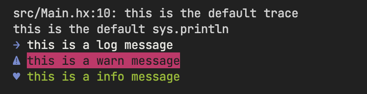

# About logging

how to log info, use colors

make logging fun again

#### resources

- https://en.wikipedia.org/wiki/ANSI_escape_code
- https://github.com/haxiomic/console.hx/blob/master/Console.hx
- https://stackoverflow.com/questions/5762491/how-to-print-color-in-console-using-system-out-println
